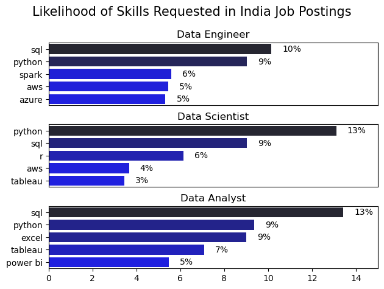
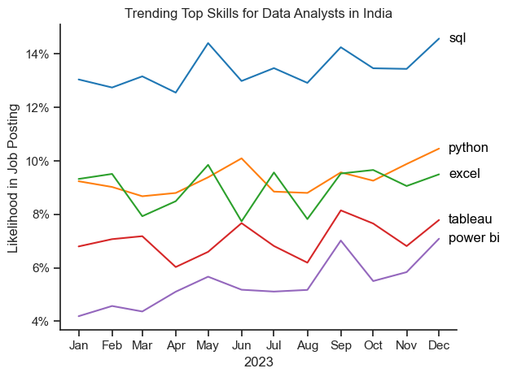
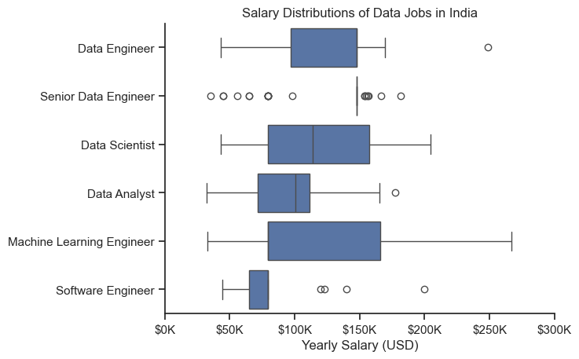
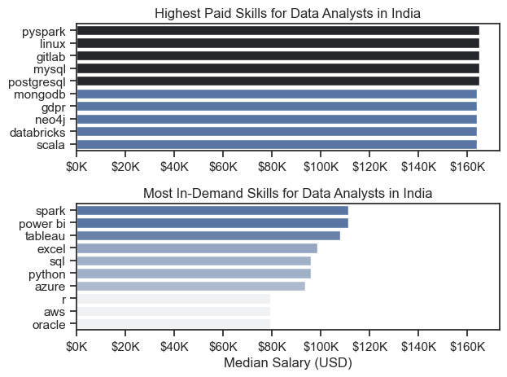
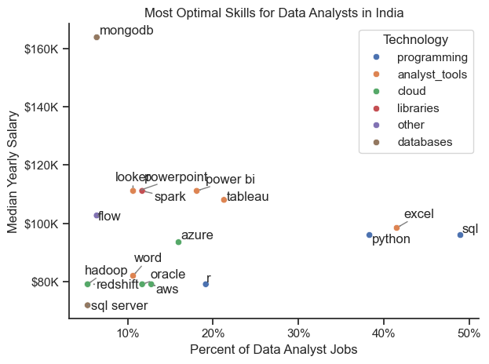

 # Overview

Welcome to my analysis of the data job market, focusing on data analyst roles. This project was created out of a desire to navigate and understand the job market more effectively. It delves into the top-paying and in-demand skills to help find optimal job opportunities for data analysts.

The data sourced from [Luke Barousse's Python Course](https://lukebarousse.com/python) which provides a foundation for my analysis, containing detailed information on job titles, salaries, locations, and essential skills. Through a series of Python scripts, I explore key questions such as the most demanded skills, salary trends, and the intersection of demand and salary in data analytics in the India Job Market.

# The Questions

Below are the questions I want to answer in my project:

1. What are the skills most in demand for the top 3 most popular data roles?
2. How are in-demand skills trending for Data Analysts?
3. How well do jobs and skills pay for Data Analysts?
4. What are the optimal skills for data analysts to learn? (High Demand AND High Paying) 

# Tools I Used

For my deep dive into the data analyst job market, I harnessed the power of several key tools:

- **Python:** The backbone of my analysis, allowing me to analyze the data and find critical insights.I also used the following Python libraries:
    - **Pandas Library:** This was used to analyze the data. 
    - **Matplotlib Library:** I visualized the data.
    - **Seaborn Library:** Helped me create more advanced visuals. 
- **Jupyter Notebooks:** The tool I used to run my Python scripts which let me easily include my notes and analysis.
- **Visual Studio Code:** My go-to for executing my Python scripts.
- **Git & GitHub:** Essential for version control and sharing my Python code and analysis, ensuring collaboration and project tracking.

# Data Preparation and Cleanup

This section outlines the steps taken to prepare the data for analysis, ensuring accuracy and usability.

## Import & Clean Up Data

I start by importing necessary libraries and loading the dataset, followed by initial data cleaning tasks to ensure data quality.

```python
# Importing Libraries
import ast
import pandas as pd
import seaborn as sns
import matplotlib.pyplot as plt  

# Loading Data
df = pd.read_csv(r'C:\Users\User\Downloads\data_jobs.csv')

# Data Cleanup
df['job_posted_date'] = pd.to_datetime(df['job_posted_date'])
def to_list(skill_list):
    if pd.notna(skill_list):
        return ast.literal_eval(skill_list)
    
df['job_skills'] = df['job_skills'].apply(to_list)
```

## Filter India Jobs

To focus my analysis on the India job market, I apply filters to the dataset, narrowing down to roles based in India.

```python
df_india = df[df['job_country'] == 'India']

```

# The Analysis

Each Jupyter notebook for this project aimed at investigating specific aspects of the data job market. Here’s how I approached each question:

## 1. What are the most demanded skills for the top 3 most popular data roles?

To find the most demanded skills for the top 3 most popular data roles. I filtered out those positions by which ones were the most popular, and got the top 5 skills for these top 3 roles. This query highlights the most popular job titles and their top skills, showing which skills I should pay attention to depending on the role I'm targeting. 

View my notebook with detailed steps here: [Skill_demand](Skill_demand.ipynb).

### Visualize Data

```python
fig, ax = plt.subplots(len(job_titles), 1)

for i, job_title in enumerate(job_titles):
    df_plot = df_skill_percent[df_skill_percent['job_title_short'] == job_title].head(5)
    sns.barplot(data=df_plot, x='skill_percentage', y='job_skills', ax=ax[i], hue='skill_count', palette='dark:b_r')

plt.show()
```

### Results



*Bar graph visualizing the salary for the top 3 data roles and their top 5 skills associated with each.*

### Insights:

- SQL is the most requested skill for Data Analysts in India, appearing in 13% of job postings, and remains highly in demand for Data Scientists and Data Engineers as well. For Data Engineers, SQL (10%) and Python (9%) dominate, showing the core need for strong data manipulation and scripting abilities.
- Data Engineers requires more specialized technical skills such as Spark, AWS, and Azure, reflecting the infrastructure-heavy nature of their work compared to Data Analysts and Data Scientists who are expected to be proficient in more general data management and analysis tools (Tableau, etc.).
- Python continues to be a universal requirement across all roles, serving as the backbone for data automation, analysis, and machine learning tasks. Overall, SQL and Python stand out as the most transferable skills across India’s data job market, while each role builds additional specialization around its specific focus areas.

## 2. How are in-demand skills trending for Data Analysts?

To find how skills are trending in 2023 for Data Analysts, I filtered data analyst positions and grouped the skills by the month of the job postings. This got me the top 5 skills of data analysts by month, showing how popular skills were throughout 2023.

View my notebook with detailed steps here: [skills_trend](skills_trend.ipynb).

### Visualize Data

```python

from matplotlib.ticker import PercentFormatter

df_plot = df_skill_percentage.iloc[:, :5]
df_plot.index = df_plot.index.to_timestamp()
sns.lineplot(data=df_plot, dashes=False, legend='full', palette='tab10')


plt.gca().yaxis.set_major_formatter(PercentFormatter(decimals=0))

plt.show()

```

### Results

  
*Bar graph visualizing the trending top skills for data analysts in India in 2023.*

### Insights:
- SQL remains the most consistently demanded skill throughout the year, and it shows a gradual increase in demand.
- Python experienced a slight decrease in demand starting around january - March, then a sudden increase in demand surpassing Excel by the end of the year.
- Both Excel and Tableau show relatively stable demand throughout the year with some fluctuations but remain essential skills for data analysts. Power BI, while less demanded compared to the others, shows a huge upward trend towards the year's end.

## 3. How well do jobs and skills pay for Data Analysts?

To identify the highest-paying roles and skills, I only got jobs in India and looked at their median salary. But first I looked at the salary distributions of common data jobs like Data Scientist, Data Engineer, and Data Analyst, to get an idea of which jobs are paid the most. 

View my notebook with detailed steps here: [salary_analysis](salary_analysis.ipynb).

#### Visualize Data 

```python
sns.boxplot(data=df_top6, x='salary_year_avg', y='job_title_short', order=job_order)

ticks_x = plt.FuncFormatter(lambda y, pos: f'${int(y/1000)}K')
plt.gca().xaxis.set_major_formatter(ticks_x)
plt.show()

```

#### Results

  
*Box plot visualizing the salary distributions for the top 6 data job titles.*

#### Insights

- There's a significant variation in salary ranges across different job titles. Data Engineer positions tend to have the highest salary potential, with up to $260K, indicating the high value placed on advanced data skills and experience in the industry.

- Senior Data Engineer and Software Engineer roles show a considerable number of outliers on the higher end of the salary spectrum, suggesting that exceptional skills or circumstances can lead to high pay in these roles even though for Senior Data Engineer roles, there are more outliers lower end signifying that the salaries can be significantly lower. In contrast, Data Scientist, Machine learning Engineer and Data Analyst roles demonstrate more consistency in salary, with fewer/no outliers.

- The median salaries does not really increase with the seniority and specialization of the roles. Infact just one senior role is from the top 6 data roles in India by median salary perspective.

### Highest Paid & Most Demanded Skills for Data Analysts

Next, I narrowed my analysis and focused only on data analyst roles. I looked at the highest-paid skills and the most in-demand skills. I used two bar charts to showcase these.

#### Visualize Data

```python

fig, ax = plt.subplots(2, 1)  

# Top 10 Highest Paid Skills for Data Analysts
sns.barplot(data=df_skills_pay, x='median', y=df_skills_pay.index, hue='median', ax=ax[0], palette='dark:b_r')


# Top 10 Most In-Demand Skills for Data Analysts')
sns.barplot(data=df_skills_demand_1, x='median', y=df_skills_demand_1.index, hue='median', ax=ax[1], palette='light:b')


plt.show()

```

#### Results
Here's the breakdown of the highest-paid & most in-demand skills for data analysts in India:


*Two separate bar graphs visualizing the highest paid skills and most in-demand skills for data analysts in India.*

#### Insights:

- The top graph shows specialized technical skills like `pyspark`, `linux`, and `Gitlab` are associated with higher salaries, some reaching up to $180K, suggesting that advanced technical proficiency can increase earning potential.

- The bottom graph highlights that foundational skills like `Spark`, `Power bi`, `Tableau`, and `Excel` are the most in-demand, even though they may not offer the highest salaries. This demonstrates the importance of these core skills for employability in data analysis roles.

- There's a clear distinction between the skills that are highest paid and those that are most in-demand. Data analysts aiming to maximize their career potential should consider developing a diverse skill set that includes both high-paying specialized skills and widely demanded foundational skills.

## 4. What are the most optimal skills to learn for Data Analysts?

To identify the most optimal skills to learn ( the ones that are the highest paid and highest in demand) I calculated the percent of skill demand and the median salary of these skills. To easily identify which are the most optimal skills to learn and visualizing the different technologies as well in the graph by adding color labels based on the technology (e.g., {Programming: Python}). 

View my notebook with detailed steps here: [optimal_skills](optimal_skills.ipynb).

#### Visualize Data

```python
from matplotlib.ticker import PercentFormatter

# Create a scatter plot
scatter = sns.scatterplot(
    data=df_DA_skills_tech_high_demand,
    x='skill_percent',
    y='median_salary',
    hue='technology'
)
plt.show()

```

#### Results

    
*A scatter plot visualizing the most optimal skills (high paying & high demand) for data analysts in India.*

#### Insights:

- The skill `Mongodb` appears to have the highest median salary of nearly $180K, despite being less common in job postings. This suggests a high value placed on specialized database skills within the data analyst profession.

- More commonly required skills like `Excel` and `SQL` have a large presence in job listings but lower median salaries compared to specialized skills like `Spark`, `Power bi` and `Tableau`, which not only have higher salaries but are also moderately prevalent in job listings.

- Skills such as `Looker`, `Spark`, `Powerpoint` and `Power bi` are towards the higher end of the salary spectrum while also being fairly common in job listings, indicating that proficiency in these tools can lead to good opportunities in data analytics.

- Analyst tools (colored orange), including Tableau and Power BI, are prevalent in job postings and offer competitive salaries, showing that visualization and data analysis software are crucial for current data roles. This category not only has good salaries but is also versatile across different types of data tasks.

# What I Learned

Throughout this project, I deepened my understanding of the data analyst job market and enhanced my technical skills in Python, especially in data manipulation and visualization. Here are a few specific things I learned:

- **Advanced Python Usage**: Utilizing libraries such as Pandas for data manipulation, Seaborn and Matplotlib for data visualization, and other libraries helped me perform complex data analysis tasks more efficiently.
- **Data Cleaning Importance**: I learned that thorough data cleaning and preparation are crucial before any analysis can be conducted, ensuring the accuracy of insights derived from the data.
- **Strategic Skill Analysis**: The project emphasized the importance of aligning one's skills with market demand. Understanding the relationship between skill demand, salary, and job availability allows for more strategic career planning in the tech industry.


# Insights

This project provided several general insights into the data job market for analysts:

- **Skill Demand and Salary Correlation**: There is a clear correlation between the demand for specific skills and the salaries these skills command. Advanced and specialized skills like Mongodb often lead to higher salaries.
- **Market Trends**: There are changing trends in skill demand, highlighting the dynamic nature of the data job market. Keeping up with these trends is essential for career growth in data analytics.
- **Economic Value of Skills**: Understanding which skills are both in-demand and well-compensated can guide data analysts in prioritizing learning to maximize their economic returns.


# Challenges I Faced

This project was not without its challenges, but it provided good learning opportunities:

- **Data Inconsistencies**: Handling missing or inconsistent data entries requires careful consideration and thorough data-cleaning techniques to ensure the integrity of the analysis.
- **Complex Data Visualization**: Designing effective visual representations of complex datasets was challenging but critical for conveying insights clearly and compellingly.
- **Balancing Breadth and Depth**: Deciding how deeply to dive into each analysis while maintaining a broad overview of the data landscape required constant balancing to ensure comprehensive coverage without getting lost in details.


# Conclusion

This exploration into the data analyst job market has been incredibly informative, highlighting the critical skills and trends that shape this evolving field. The insights I got enhance my understanding and provide actionable guidance for anyone looking to advance their career in data analytics. As the market continues to change, ongoing analysis will be essential to stay ahead in data analytics. This project is a good foundation for future explorations and underscores the importance of continuous learning and adaptation in the data field.
